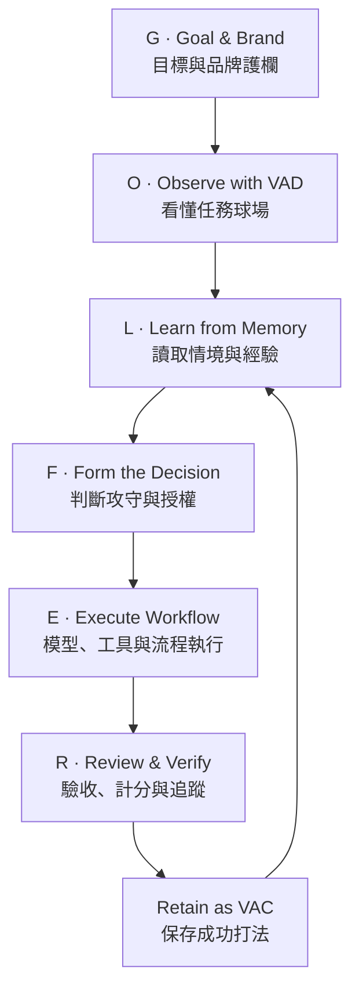

# Enterprise AI Golfer Framework

> **AI Coach × Golf Coach：把企業 AI 從「會回答」帶到「會判斷、會執行、會記住」。**

**AI Coach 益力康陳董 | 2026 AI to Agent**

`v0.1.0` · `繁體中文` · `CC BY 4.0` · `Schema-validated examples`

## 一句話定義

> **AI Coach 定方向與邊界；AI Golfer 根據 VAD 與 Memory 看懂球位，選擇策略、模型與工具，透過 Workflow 執行，以 Verify 計分，成功後沉澱為 VAC，並在品牌護欄內持續複用。**

這是一套以「企業決策」為中心、以高爾夫球場管理為共同語言的 AI 導入方法論。模型只是球桿，工具只是裝備；真正形成競爭力的是企業能否把每一次成功決策，轉成可重用、可驗證、可治理的能力。

## 為什麼不是 AI Caddie？

| 角色 | 高爾夫情境 | 企業 AI 對應 |
| --- | --- | --- |
| AI Coach | 設定訓練目標、策略與紀律 | 建立方法、治理、品牌、能力標準 |
| AI Caddie | 提供距離與選桿建議 | 分析、提醒、推薦方案的助理 Agent |
| **AI Golfer** | **判斷攻守、選桿、擊球並承擔結果** | **理解任務、做出決策、調度工具、完成任務的決策型 Agent** |

企業要導入的不是只會建議的 AI，而是能在授權範圍內完成任務、留下紀錄、接受驗收的 Agent。高風險決策仍由人類主管負責最終核准。

## GOLFER 決策閉環



| 字母 | 決策問題 | 核心產物 |
| --- | --- | --- |
| G — Goal & Brand | 為何做？成功長什麼樣？不能犧牲什麼？ | Business Score、Brand Guardrail |
| O — Observe | 現在的任務、資料、風險與限制是什麼？ | VAD Course Map |
| L — Learn | 過去遇過嗎？哪些知識可信、可用、仍有效？ | Course Memory |
| F — Form | 攻、守、升級、停下或交由人決定？ | Decision Record |
| E — Execute | 用哪個模型、工具與步驟完成？ | Workflow、MCP/Tool Route |
| R — Review | 結果是否達標？代價、風險與品牌是否合格？ | Verify、Scorecard |
| Retain | 哪些成功條件可固化、版本化與再利用？ | VAC Shot Playbook |

## 高爾夫與企業 AI 對照表

| 高爾夫概念 | 企業 AI 元件 | 功能 |
| --- | --- | --- |
| 球場與旗位 | Business Context / Goal | 定義環境與成果 |
| Course Map | VAD | 把目標、素材、限制、流程與驗收視覺化 |
| Yardage Book | Memory | 保存事實、歷史、偏好、限制與來源 |
| Golfer | Decision Agent | 判斷攻守並承擔一次決策 |
| Golf Bag / Clubs | Model Registry | 依難度、風險、成本選擇模型 |
| Equipment | Tools / MCP | 連接搜尋、資料、ERP、CRM、文件與執行工具 |
| Pre-shot Routine | Workflow | 把決策變成可追蹤步驟 |
| Ball Flight / Scorecard | Verify / Metrics | 驗證輸出與商業結果 |
| Shot Pattern | VAC | 保存已驗證的成功打法 |
| Handicap | Capability Score | 評估任務、Agent 與企業成熟度 |
| Team Identity | Brand System | 約束語氣、視覺、承諾與一致性 |

## 六項不可替代的企業資產

1. **VAD — Visual Agent Design**：讓人與 Agent 先對齊「球場全貌」，而不是急著寫提示詞。
2. **VAC — Visual Agent Capability**：把已驗證的方法固化成可重用能力，而不是把一次成功留在對話紀錄。
3. **Memory**：保存可追溯的事實、決策理由、歷史結果與版本，不把記憶當作未驗證真相。
4. **Workflow**：明確定義輸入、步驟、工具、權限、例外、驗收與回復路徑。
5. **Decision Governance**：決定何時自動、何時升級模型、何時需要人工核准、何時必須停止。
6. **Brand Guardrail**：把品牌語氣、視覺、聲明、禁語與責任邊界變成系統規格。

## 模型只是球桿

| 球桿 | 任務類型 | 建議路由原則 |
| --- | --- | --- |
| Putter | 固定格式、規則明確、低風險 | 低成本模型或規則引擎 |
| Wedge | 短內容、局部修改、大量重複 | 輕量模型＋模板 |
| Iron | 一般分析、文件整理、日常主力 | 通用模型＋標準 Workflow |
| Hybrid | 跨資料、工具調用、複合任務 | 平衡型推理模型＋Verify |
| Fairway Wood | 高複雜策略、長上下文 | 高階模型＋多來源驗證 |
| Driver | 未知、高影響、高探索性 | 頂級推理＋人類決策權 |

> 已知、重複、可回復的任務應逐步降成本；未知、高影響、不可回復的任務才升級推理與人工治理。

## 專案地圖

```text
AI-to-Agent-GOLFER/
├── docs/          # 完整方法論、治理、成熟度與案例說明
├── schemas/       # VAD、Memory、Decision、Workflow、Verify、VAC、Brand 規格
├── templates/     # 可直接複製填寫的工作表
├── examples/      # 會議到行動、製造業供應商延遲案例
├── curriculum/    # 30 分鐘簡報、3 小時工作坊、6 小時教案與評量
├── scripts/       # 範例規格驗證器
└── tests/         # 結構驗證測試
```

## 建議閱讀順序

1. [方法論總覽](docs/00-methodology-overview.md)
2. [核心角色與名詞](docs/01-core-ontology.md)
3. [GOLFER 決策閉環](docs/02-golfer-decision-loop.md)
4. [企業治理與人類決策權](docs/03-governance-and-human-accountability.md)
5. [成熟度與導入路線](docs/04-maturity-model-and-roadmap.md)
6. [AI Handicap 與衡量](docs/05-ai-handicap-and-metrics.md)
7. [相關技術與差異化](docs/06-related-work.md)
8. [作者與品牌](docs/07-author-and-brand.md)

## 立即開始：完成一張 Enterprise Shot Card

1. 複製 [`templates/enterprise-shot-card.md`](templates/enterprise-shot-card.md)。
2. 先填 Goal、Brand 與 VAD，不先決定模型。
3. 讀取 Memory，標記來源、時效與可信度。
4. 寫下攻守策略、風險、授權等級與停止條件。
5. 再選模型、工具與 Workflow。
6. 以 Verify 驗收；成功才轉成 VAC。

範例：[`examples/meeting-to-action/README.md`](examples/meeting-to-action/README.md)。

## 教學版本

- [30 分鐘高階主管簡報](curriculum/30-minute-executive-briefing.md)
- [3 小時企業工作坊](curriculum/3-hour-workshop.md)
- [6 小時完整課程](curriculum/6-hour-course-plan.md)
- [講師手冊](curriculum/instructor-guide.md)
- [學員工作簿](curriculum/learner-workbook.md)
- [100 分成果評量表](curriculum/assessment-rubric.md)

## 專案邊界

本專案是上層的企業決策、能力沉澱與治理方法論，不是另一套模型 Router。它可搭配任何模型供應商、Semantic Router、Agent Runtime、MCP 或企業既有系統。健康、財務、法律、人事、安全與重大營運決策，應配置適當專家、資料治理與人類核准。

## 品牌與引用

公開教學時請保留：

> **AI Coach 益力康陳董 | 2026 AI to Agent**

引用格式與授權請見 [CITATION.cff](CITATION.cff) 與 [LICENSE.md](LICENSE.md)。
