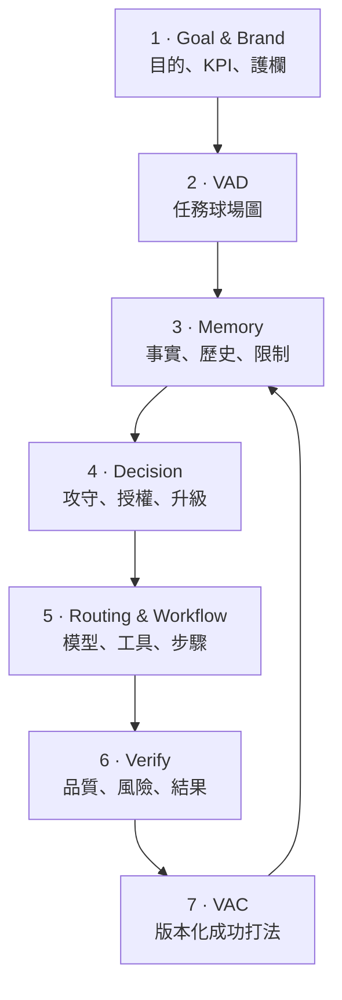

# 00｜方法論總覽

**AI Coach 益力康陳董 | 2026 AI to Agent**

## 核心主張

企業 AI 導入的瓶頸通常不只是模型能力，而是六個管理問題：目標不清、情境不足、決策權模糊、流程不可追蹤、結果未驗證、成功無法複用。

Enterprise AI Golfer Framework 以一場高爾夫球賽來重新組織這些問題：

- AI Coach 建立能力、紀律、品牌與責任邊界。
- AI Golfer 在授權範圍內讀取情境、做出決策、選擇資源並完成任務。
- 每一次執行都要計分；只有通過驗收的打法，才可沉澱為 VAC。

## 從 AI 到 Agent 的五個轉變

| AI 使用思維 | Agent 系統思維 |
| --- | --- |
| 問一個問題 | 定義一個可驗收的任務 |
| 追求漂亮回答 | 追求可證明的商業結果 |
| 人工複製貼上 | 透過工具與 Workflow 執行 |
| 每次重新提示 | 從 Memory 與 VAC 取回經驗 |
| 模型是主角 | 決策、治理與企業能力是主角 |

## 七層企業架構

## 九項設計原則

1. **Decision before Model**：先決定要打什麼球，再選球桿。
2. **Context before Prompt**：先建立情境與限制，再要求生成。
3. **Risk shapes Intelligence**：模型等級由風險、影響與可回復性共同決定。
4. **Known Work Gets Cheaper**：任務愈成熟、愈重複，單次成本應下降。
5. **Workflow Makes Action Visible**：任何自動化都要看得見輸入、步驟、權限與例外。
6. **Verify before Reuse**：未驗收的結果不是企業能力。
7. **Memory Is Evidence, Not Truth**：記憶必須有來源、時效、可信度與失效規則。
8. **Brand Is a Constraint**：品牌不是最後美化，而是決策與輸出的系統護欄。
9. **Human Accountability Remains**：AI 可以執行，人類仍需對重大決策與制度負責。

## 三種可用方式

### 教學語言

用 Golfer、球位、攻守、球桿、流程與記分，讓非技術主管理解 Agent 架構。

### 企業工作法

用 VAD、Decision Record、Workflow、Verify 與 VAC 將任務制度化。

### 技術治理規格

用 YAML Schema、版本、權限、稽核與測試，讓方法論能進入實際系統。

## 成功條件

方法論的價值不以文件數量判斷，而以五個結果衡量：

- 任務首次對齊時間下降。
- 返工與人工交接次數下降。
- 低風險任務自動完成率提升。
- 重大錯誤與品牌違規率受控。
- 經驗被轉成 VAC，重用率持續上升。
