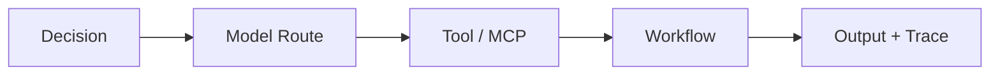

# 02｜GOLFER 決策閉環

## G — Goal & Brand

先定義商業比分與品牌底線。

- 要改善的 KPI 是什麼？
- 誰受到影響？
- 可接受的成本、時限與錯誤是多少？
- 有哪些承諾、法規、品牌或倫理限制？

輸出：Goal Card、Business Score、Brand Guardrail。

## O — Observe with VAD

把任務視為一個球位，而不是一句 Prompt。

- 現在的位置、目標與障礙是什麼？
- 輸入是否齊全、衝突或過期？
- 哪些步驟必須由人、Agent 或工具完成？
- 驗收長什麼樣？

輸出：VAD Course Map。

## L — Learn from Memory

取回事實與經驗，但不盲從。

1. 找到與任務相關的政策、數據、案例與 VAC。
2. 檢查來源、版本、權限、時效與可信度。
3. 對衝突資料建立優先順序。
4. 對缺口做明確標記，不用推測填滿。

輸出：Memory Pack、Evidence List、Knowledge Gaps。

## F — Form the Decision

決策不是列出所有可能，而是選擇下一步。

### 六種標準策略

| 策略 | 何時使用 |
| --- | --- |
| Attack | 高價值、證據足、風險可控、可回復 |
| Play Safe | 失敗影響高或資訊不足，但仍可做保守行動 |
| Escalate Model | 任務未知或推理複雜，低階模型信心不足 |
| Ask / Retrieve | 缺少關鍵資料、授權或需求 |
| Human Approval | 高風險、不可回復、受規範或重大品牌承諾 |
| Stop | 違反政策、資料不可信、超出權限或安全界線 |

輸出：Decision Record、Risk Tier、Authorization Level。

## E — Execute Workflow

決策完成後才選球桿與裝備。

執行必須留下：輸入版本、模型/工具版本、步驟、工具結果、人工介入、錯誤、成本與輸出。

## R — Review & Verify

一次漂亮輸出不等於成功。Verify 至少覆蓋：

- 任務正確性與完整性。
- 來源與數字可追溯性。
- 權限、隱私、安全與法規。
- 品牌語氣、視覺與承諾。
- 成本、延遲與人工時間。
- 最終商業 KPI。

輸出：Verify Report、Scorecard、Repair / Approve / Reject。

## Retain — Save as VAC

符合下列條件才保存：

1. 通過最低 Verify 門檻。
2. 至少有一次可重播的執行紀錄。
3. 適用與不適用情境明確。
4. 有責任人、版本與失效日期。
5. 高風險用途已有核准規則。

如果失敗，應更新 Memory 與 Decision Rule，而不是把錯誤變成 VAC。
