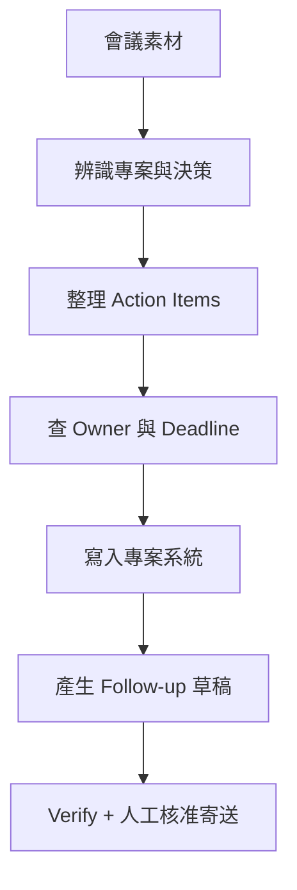

# 案例一｜會議到行動

> 本目錄為方法論教學用的合成案例；人名、記錄、分數與成果均為示範資料，不代表真實客戶成效。

## 任務

將核准的會議錄音與逐字稿，轉成 Meeting Notes、Decisions、Action Items、Owner、Deadline，寫入專案系統並產生待寄 follow-up 草稿。

## 為什麼適合第一個 Pilot？

- 任務高頻、可量測、結果可人工核對。
- 寫入前可保留人工核准，容易控制風險。
- 成功後能形成穩定 VAC，跨部門重用。

## 檔案

- `vad.yaml`：任務球場與驗收。
- `memory.yaml`：專案、Owner 與期限來源。
- `decision.yaml`：保守執行與寫入權限。
- `workflow.yaml`：步驟、工具與例外。
- `verify.yaml`：品質與品牌計分。
- `vac.yaml`：可重用能力契約。
- `brand.yaml`：對外／內部溝通護欄。
